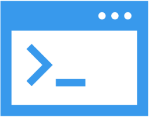

# pi-cli

## Open. Flexible. Cross-Platform.
> ***The most flexible cross-platform framework for building modern CLI and terminal apps.***

`pi-cli` (oneterminal) is a cross-platform adaptable framework designed for crafting CLI and terminal applications, from basic apps with a few options to advanced terminals with extensive command hierarchies.

> ***Take Your App to the Command Line:*** Easily build CLI and terminal applications with Unicode support.

### **Key Features**:
- Utilize microservices architecture, Dependency Injection (DI), and options pattern to design and configure your terminal apps.
- Access built-in features or develop your own solutions for terminal UX, input parsing, error handling, command validation, data storage, and type verification.
- Opt for high-performance in-memory command storage or integrate with remote storage solutions.
- Compatible with Windows, Linux, macOS, Docker, Kubernetes, and more.
- Create deployment-agnostic CLI terminals, test locally, and deploy on-premise, cloud (public, private, or government), or in hybrid environments.
- Build secure enterprise-level CLI or terminal applications.
- Engage with our open-source community to resolve issues and contribute to feature enhancements and documentation.
- Quickly onboard, evaluate, and test with our [demo license](https://docs.perpetualintelligence.com/articles/pi-demo/intro.html) and ready samples on GitHub, no signup required.

`pi-cli` cuts through infrastructure complexity, letting you concentrate on crafting your CLI applications. Quickly dive in with our [templates and tutorials](https://github.com/perpetualintelligence/docs/tree/main/samples/templates/pi-cli).

> ***Transform any .NET ecosystem feature into a CLI or terminal app with ease.***

## License and Pricing
Explore our documentation for detailed information on licensing, redistribution, and pricing:
- [Licensing terms](https://terms.perpetualintelligence.com/articles/licensing.html)
- [Redistribution terms](https://terms.perpetualintelligence.com/articles/redistribution.html)
- [Pricing details](https://www.perpetualintelligence.com/products/picli#pricing)

> ***The full-feature `pi-cli` framework is free for educational and evaluation purposes.***

For non-educational, release, deployment, or production use, a commercial license is required.

## Documentation and Support
Explore our [documentation repository](https://github.com/perpetualintelligence/docs) for detailed guides and code samples.

## Feedback and Community
Stay informed and contribute through our [issues and tasks tracker](https://github.com/perpetualintelligence/cli/issues). Learn about our issue handling processes in our [Issues Policy](https://terms.perpetualintelligence.com/articles/issues-policy.html). Our community follows the Contributor Covenant; read our [Code of Conduct](https://terms.perpetualintelligence.com/articles/CODE_OF_CONDUCT.html) for more details.